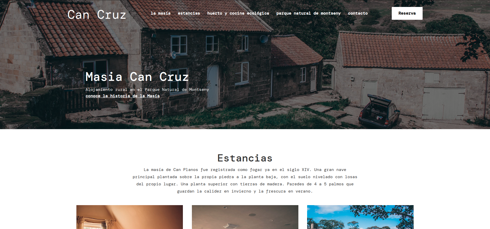
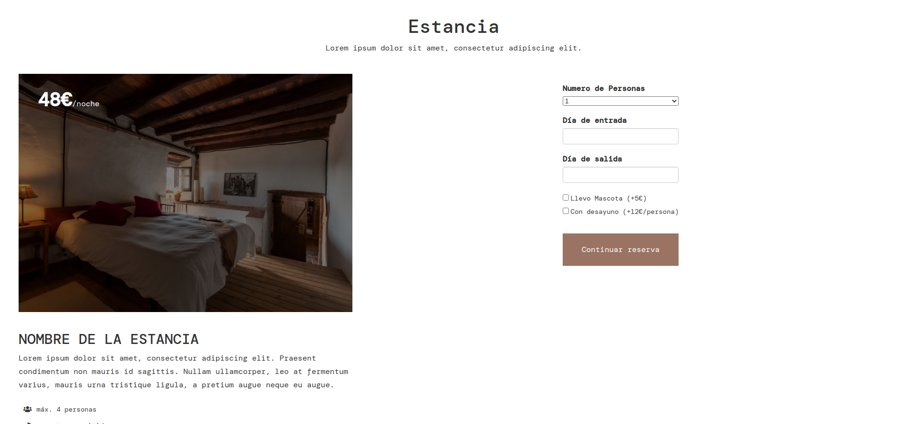
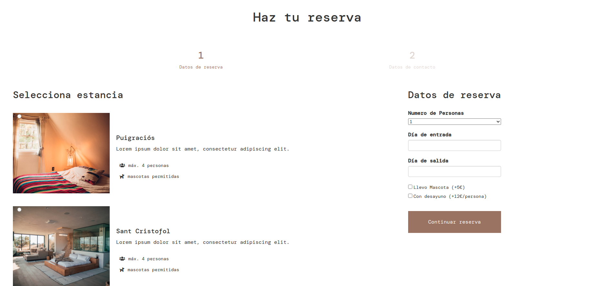
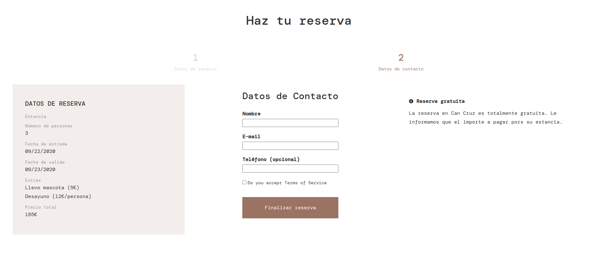
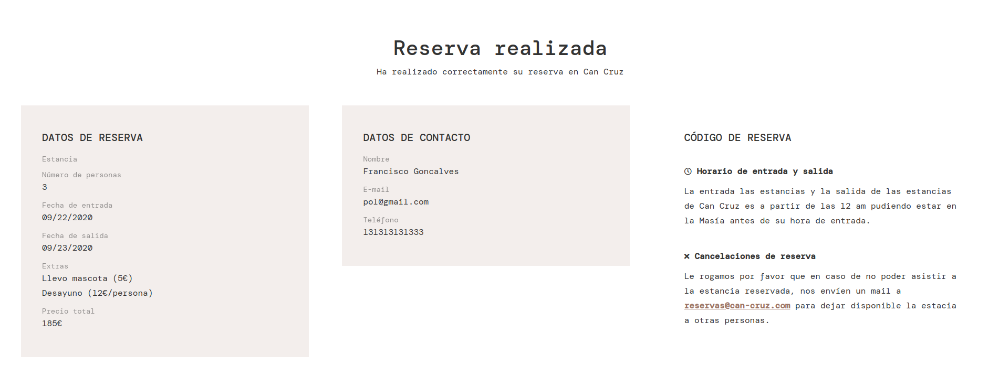
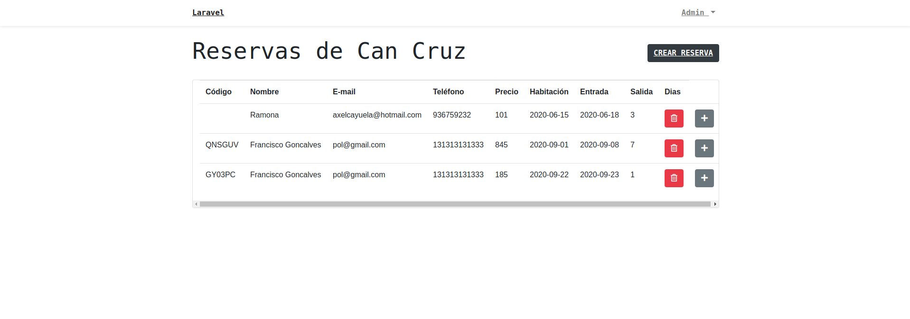

# CanCruz

### Made by:

-   **Axel**
-   **Eva**
-   **Alen**
-   **Francisco**

### Summary

This was our first big project with Laravel! We had three weeks to create a full website for a hostal with a reservation system where the clients could create a reservation. There also had to be an admin dashboard where the owners would be able to view a list of reservations!

## My objective

Like all other projects we made in the Bootcamp the objective was to Learn! This was only our second project with Laravel so there was still a lot of things we had never used or done before.

In this project we had to have an admin user that would be able to login and view the dashboard. So this is where we began. We never used the built in authentication system so this was a great oportunity to do so!

The frontend was also very important. The user experience was key with this project because it could make the difference between a user making a reservation or clicking off the page. This was probably where I learnt the most about design and ux. (thanks to Eva!!)

## What I learnt

**Authentication:** I still have a lot to learn after this project and things to improve but the fundamental worked. The dashboard was locked away from any kind of user. So you had to be logged in to see the admin dashboard. Things to imporve: remove the register option. As it stands now any user can register and access the admin dashboard... oops

**UX/UI:** I am really happy with the final outcome. I think we managed to design a very nice user experience making it responsive and easy to use, but not only that. We used sass which is something I was familiar with before. But I really focoused on encapsulating my sass code into multiple reusable components and using mixins and variables to make it as scalable as possible.

## Reservation System

It had no payment system. The idea was that the client would pay once he got to the Hostal.

#### There are two ways of starting a reservation:

-   Visiting the room page and reserving straight from there:
    

-   Clicking the reservation button and choosing a room from there:
    

Once you had chosen the room and how many people would be staying you would be redirected to the second stage:

And once you had done that you would be shown the final page with all the information about the reservation you just made:

## Admin Dashboard

This is where the owners of the hostal would be able to manage their reservations. They would be able to delete edit and view each reservation:

